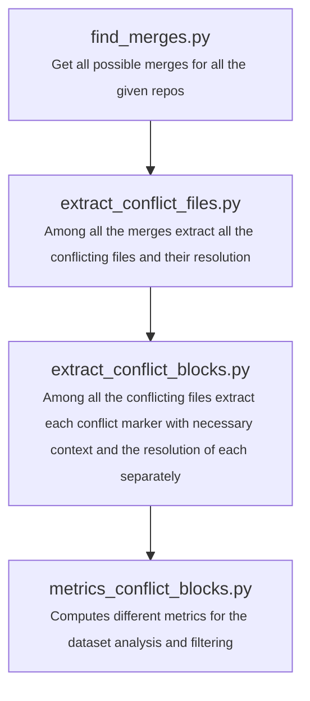

# LLMerge


## Installation

Install uv following this [guide](https://docs.astral.sh/uv/getting-started/installation/#standalone-installer) or simply use this quick command:

```bash
pip install uv
```

Install all dependencies and activate the venv with the following command:

```bash
uv sync
source .venv/bin/activate
```

## Usage

### Run small example

```bash
./build_dataset_small.sh
```

## Code Structure


